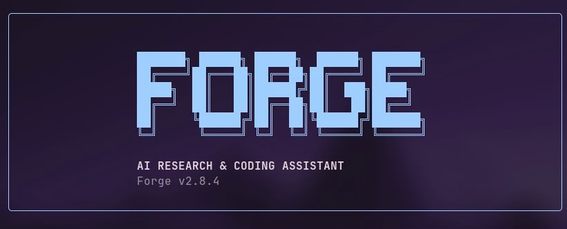
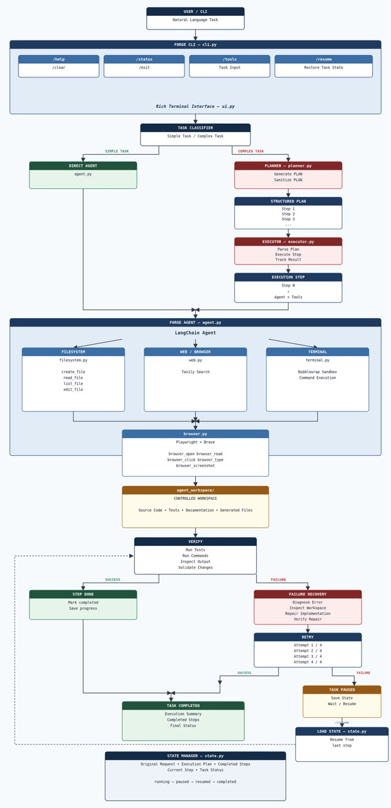
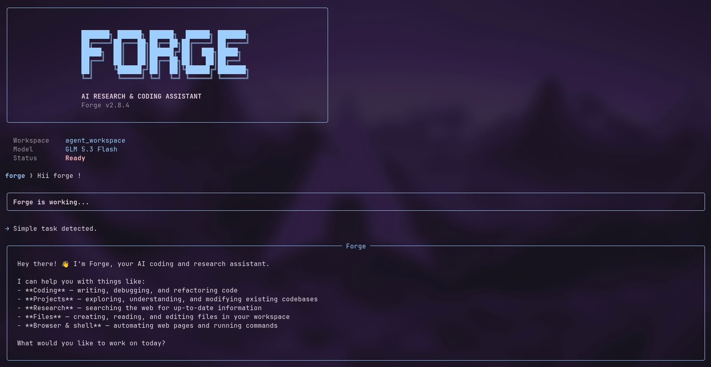

<div align="center">
  

  <h1>Forge</h1>
  <p><strong>AI-Powered Research and Coding Assistant</strong></p>

  <!-- Badges -->
  
  
  
  
  
  
</div>

## Overview
Forge is an advanced AI-powered research and coding assistant designed to plan tasks, execute them step by step, use tools effectively, verify results, recover from failures, retry failed steps, and preserve execution state. It orchestrates a structured execution pipeline: User Request → Task Classification → Planner → Structured Plan → Executor → Agent → Tools → Verification → Recovery/Retry.

## Core Architecture
Forge maintains a strict separation between planning and execution.



## Features
- **Task Planning**: Breaks down complex user requests into structured, executable plans.
- **Step-by-Step Execution**: Executes tasks systematically following the generated plan.
- **Structured Execution Results**: Maintains explicit outcomes for each step.
- **Failure Detection**: Actively monitors tool outputs and agent responses for errors.
- **Automatic Failure Recovery**: Dynamically responds to failures via a specialized workflow: Diagnose → Inspect Workspace → Repair → Verify → Retry.
- **Automatic Retries**: Retries execution steps when transient issues occur.
- **Persistent State & Resume**: Preserves the execution state, allowing users to pause and resume workflows seamlessly.
- **Workspace Isolation**: Keeps development environments separated and secure.
- **Sandboxed Terminal**: Executes terminal commands securely using a Bubblewrap sandbox.
- **Web Research**: Conducts thorough research across the web.
- **Browser Automation**: Navigates and interacts with web applications dynamically.
- **Rich Terminal Interface**: Provides a professional, interactive CLI experience.

## CLI


Forge offers an interactive command-line interface with several commands:
- `/help`: Displays available commands and usage instructions.
- `/status`: Shows the current execution status and active plan.
- `/tools`: Lists the available tools and their configurations.
- `/resume`: Resumes execution from a preserved state.
- `/clear`: Clears the current session and resets state.
- `/exit`: Exits the application safely.

## Available Tools
- **Filesystem**: Create, read, list, and edit files in the workspace.
- **Web**: Intelligent search using Tavily.
- **Browser**: Full browser automation using Playwright and Brave.
- **Terminal**: Secure execution environment using Bubblewrap sandbox.

## Example
1. **User Request**: "Build a Python script to scrape a website and save the data to a CSV."
2. **Planning**: Forge analyzes the request and generates a plan: 1. Research target site structure. 2. Write scraper script. 3. Test script. 4. Verify CSV output.
3. **Execution**: The Executor triggers the Agent for step 1, using Browser and Web tools to inspect the site.
4. **Verification & Recovery**: The Agent executes step 2. During step 3, an import error occurs. The Failure Detection kicks in: Diagnoses the missing library → Repairs by installing it via Terminal tool → Verifies installation → Retries step 3.
5. **Completion**: The final CSV is verified and presented to the user.

## Project Structure
```text
Forge-agent/
├── forge/
│   ├── agent.py
│   ├── cli.py
│   ├── config.py
│   ├── executor.py
│   ├── planner.py
│   ├── prompts.py
│   ├── state.py
│   ├── ui.py
│   └── __init__.py
├── tools/
│   ├── browser.py
│   ├── filesystem.py
│   ├── terminal.py
│   ├── web.py
│   └── __init__.py
├── docs/
│   └── images/
│       ├── forge_arch.jpeg
│       ├── forge_cli.jpeg
│       └── forge_logo.jpeg
├── agent_workspace/
├── main.py
├── requirements.txt
├── README.md
└── test files
```

## Main Components

| Component | Description |
|-----------|-------------|
| `forge/cli.py` | Command-line interface and user interaction logic. |
| `forge/planner.py` | Analyzes user requests and breaks them into structured steps. |
| `forge/executor.py` | Orchestrates step-by-step execution, verification, and recovery. |
| `forge/agent.py` | The core agent responsible for taking actions based on plan steps. |
| `forge/state.py` | Manages persistent execution state for pausing and resuming. |
| `forge/ui.py` | Renders the Rich-based visual interface. |
| `tools/filesystem.py`| File creation, reading, and modification capabilities. |
| `tools/web.py` | Web searching and information gathering. |
| `tools/browser.py` | Automates browser interaction for complex web tasks. |
| `tools/terminal.py` | Securely runs shell commands in an isolated sandbox. |

## Technology Stack
- **Languages**: Python
- **AI/LLM**: LangChain, OpenRouter
- **Tools/APIs**: Tavily, Playwright, Brave
- **UI**: Rich
- **Security**: Bubblewrap
- **VCS**: Git, GitHub

## Installation

### Requirements
- Python 3.10+
- Bubblewrap (for terminal sandbox)
- Brave Browser

### Setup
```bash
# Clone the repository
git clone https://github.com/amine-mlops/Forge-agent.git
cd Forge-agent

# Create and activate a virtual environment
python -m venv venv
source venv/bin/activate  # On Windows use `venv\Scripts\activate`

# Install dependencies
pip install -r requirements.txt

# Install Playwright browsers
playwright install
```

## Environment Variables
Create a `.env` file in the root directory and configure the following keys:
```env
OPENROUTER_API_KEY=your_openrouter_api_key
TAVILY_API_KEY=your_tavily_api_key
```

## Running Forge
Start the Forge assistant:
```bash
python main.py
```

## Testing
To run the test suite and verify file compilation:
```bash
python -m compileall .
python -m unittest discover tests/
```

## Development Status
- [x] Task Classification
- [x] Structured Planning
- [x] Step-by-Step Execution
- [x] Tool Integration (Filesystem, Web, Terminal, Browser)
- [x] Sandboxed Terminal
- [x] Persistent State & Resume
- [x] Rich Terminal Interface
- [x] Failure Detection & Automatic Recovery
- [ ] Advanced Code Verification
- [ ] Autonomous Debugging

## Version History
- **V2.9**: Rich CLI and UI improvements
- **V2.8**: Failure detection, diagnosis, recovery and retries
- **V2.7**: Persistent state and resume
- **V2.6**: Structured planning
- **V2.0**: New Forge architecture
- **V1.0**: Initial prototype

## Roadmap
- Advanced code verification
- Autonomous debugging
- Better planning
- Parallel execution
- Improved browser interaction
- Long-term memory
- Git-aware workflows
- Multi-agent collaboration
- Web interface
- Stronger sandboxing
- Autonomous software development

## Design Principles
1. **Plan Before Execution**: Ensure structured understanding before taking action.
2. **Explicit Execution State**: Maintain clarity on current progress and outcomes.
3. **Verification Over Assumptions**: Always verify the result of a tool execution.
4. **Recover Instead of Giving Up**: Automatically diagnose and attempt to repair errors.
5. **Controlled Tool Access**: Use tools with least privilege, operating in isolated environments.
6. **Incremental Development**: Build capabilities iteratively for robustness.

## Project Goals
Forge aims to be a practical autonomous development agent capable of traversing the full software lifecycle autonomously:
Understand → Plan → Research → Implement → Execute → Test → Debug → Repair → Verify → Deliver.

## Author
**Amine El-baydaouy**  
AI & Data Engineering Student  
ENSAM Rabat, Morocco

- **GitHub**: [amine-mlops](https://github.com/amine-mlops)
- **Project**: [Forge-agent](https://github.com/amine-mlops/Forge-agent)

## License
This project is currently under active development.
